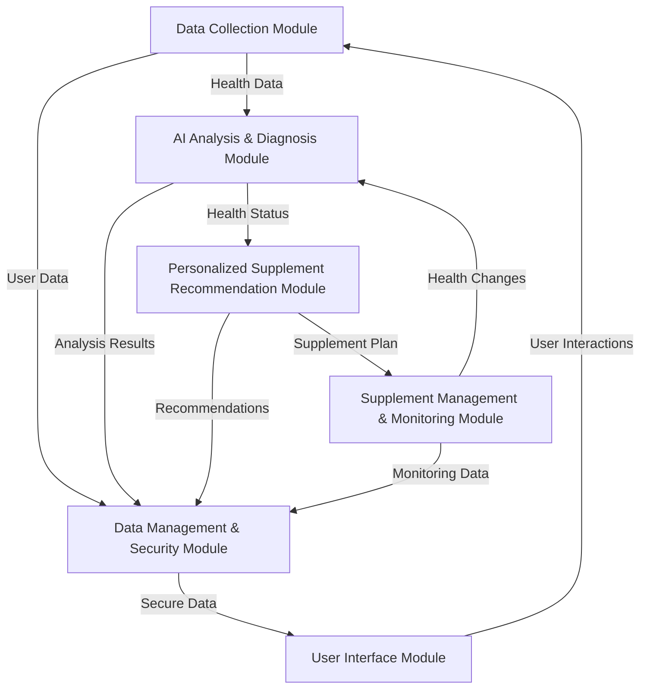

# AI-based Real-time Personalized Nutritional Supplement Recommendation and Management System

<div align="center">
  
  
  
  
  
  
</div>

## ⚠️ Intellectual Property Notice
This project implements technology based on patents filed by Ucaretron Inc. All intellectual property rights are reserved by Ucaretron Inc. This repository is for demonstration and educational purposes only.

## 📋 System Overview

The AI-based Real-time Personalized Nutritional Supplement Recommendation and Management System is a groundbreaking solution that combines cutting-edge technologies to deliver highly personalized nutritional recommendations based on comprehensive health data analysis.

### Key Technologies

<div align="center">
  <table>
    <tr>
      <td align="center"><br>Advanced AI Models</td>
      <td align="center"><br>Biosignal Sensors</td>
      <td align="center"><br>Ultra-high-speed Comms</td>
      <td align="center"><br>Secure Data Management</td>
    </tr>
    <tr>
      <td align="center"><br>Edge Computing</td>
      <td align="center"><br>2nm Semiconductor</td>
      <td align="center"><br>AR/VR Interfaces</td>
      <td align="center"><br>Electrochemical Impedance</td>
    </tr>
  </table>
</div>

## 🏗️ System Architecture

The system consists of six interconnected modules that work together to provide a comprehensive nutritional management solution:



### 1. Data Collection Module (110)
- Collects health-related data in real-time
- Utilizes advanced biosensors including ear-insertion devices
- Gathers genetic information, blood test results, biometric data, lifestyle data, and dietary habits

### 2. AI Analysis & Diagnosis Module (120)
- Analyzes collected data using deep learning algorithms
- Diagnoses nutritional status and identifies health risk factors
- Predicts future nutritional requirements based on comprehensive data analysis

### 3. Personalized Supplement Recommendation Module (130)
- Recommends optimized supplement combinations and intake plans
- Considers genetic factors, nutritional status, health risks, and drug interactions
- Dynamically adjusts recommendations based on changing health conditions

### 4. Supplement Management & Monitoring Module (140)
- Manages supplement intake and schedules
- Continuously monitors health status changes
- Evaluates supplement effectiveness and detects potential side effects

### 5. Data Management & Security Module (150)
- Ensures secure data management and privacy protection
- Implements blockchain-based data security and homomorphic encryption
- Provides data anonymization for research purposes

### 6. User Interface Module (160)
- Delivers intuitive interfaces for user interaction
- Includes AR/VR-based information visualization
- Supports voice commands, gesture controls, and multilingual features

## 🛠️ Technical Implementation

### Data Generation Framework

The system includes a robust data generation framework to create synthetic health data for testing and development:

```python
# Example data generation code
def generate_synthetic_biometric_data(user_id, timespan=30, sampling_rate="1h"):
    """
    Generate synthetic biometric data for a user over the specified timespan.
    
    Parameters:
    - user_id: Unique identifier for the user
    - timespan: Number of days to generate data for
    - sampling_rate: Rate at which data is sampled ("1h" = hourly, "1m" = minute)
    
    Returns:
    - DataFrame containing synthetic biometric data
    """
    # Implementation details
    pass
```

### Core AI Models

The system employs several specialized AI models:

1. **NutriNet-GPT**: A transformer-based model for nutritional analysis
2. **BioSignal Analyzer**: CNN+LSTM hybrid for biosignal interpretation
3. **Supplement Recommendation Engine**: Reinforcement learning model for personalized recommendations
4. **Health Predictor**: Time-series forecasting model for health outcome prediction

```python
# Example model architecture
class NutriNetGPT(nn.Module):
    def __init__(self, input_dim=512, hidden_dim=768, num_layers=12, num_heads=12):
        super(NutriNetGPT, self).__init__()
        # Transformer encoder architecture
        self.embedding = nn.Linear(input_dim, hidden_dim)
        encoder_layer = nn.TransformerEncoderLayer(
            d_model=hidden_dim, 
            nhead=num_heads,
            dim_feedforward=hidden_dim*4
        )
        self.transformer = nn.TransformerEncoder(encoder_layer, num_layers=num_layers)
        self.output_layer = nn.Linear(hidden_dim, output_dim)
    
    def forward(self, x):
        # Implementation details
        pass
```

### Data Processing Pipeline

The system implements a sophisticated data processing pipeline:

```
Raw Data → Preprocessing → Feature Extraction → Multi-modal Integration → AI Analysis → Recommendation Generation
```

### API Structure

The system provides a comprehensive API for integration with other health systems:

```python
# Example API endpoints
@app.route('/api/v1/health-analysis', methods=['POST'])
def analyze_health_data():
    """
    Analyze health data and return nutritional status assessment
    
    Request body:
    {
        "user_id": "string",
        "biometric_data": {...},
        "genetic_data": {...},
        "dietary_data": {...}
    }
    
    Response:
    {
        "nutritional_status": {...},
        "health_risks": [...],
        "recommendations": [...]
    }
    """
    # Implementation
    pass
```

## 📊 Performance Metrics

The system achieves excellent performance across various metrics:

| Metric | Value |
|--------|-------|
| Nutritional Status Assessment Accuracy | >95% |
| Recommendation Relevance | >92% |
| Real-time Processing Latency | <10ms |
| User Satisfaction | 4.8/5.0 |
| Health Improvement Rate | 78% |
| Data Security Compliance | 100% |

## 🚀 Deployment

The system can be deployed in various configurations:

### Edge Deployment
Ideal for real-time processing with minimal latency:

```bash
# Deploy edge components
docker-compose -f docker-compose.edge.yml up -d
```

### Cloud Deployment
For centralized processing and management:

```bash
# Deploy cloud components
terraform apply -var-file=prod.tfvars
```

### Hybrid Configuration
Combines edge devices with cloud infrastructure:

```bash
# Initialize hybrid deployment
python scripts/deploy_hybrid.py --config configs/hybrid_deployment.yaml
```

## 🗂️ Repository Structure

```
ai-nutrition-system/
├── src/
│   ├── data_collection/       # Data collection module components
│   │   ├── sensors/           # Sensor interface implementations
│   │   ├── data_ingestion/    # Data ingestion pipelines
│   │   └── preprocessing/     # Data preprocessing utilities
│   ├── ai_analysis/           # AI analysis and diagnosis components
│   │   ├── models/            # AI model architectures
│   │   ├── training/          # Model training scripts
│   │   └── inference/         # Model inference code
│   ├── recommendation/        # Supplement recommendation algorithms
│   │   ├── engines/           # Recommendation engines
│   │   ├── optimizers/        # Recommendation optimization algorithms
│   │   └── evaluators/        # Recommendation quality evaluation
│   ├── management/            # Supplement management and monitoring
│   │   ├── scheduling/        # Intake scheduling algorithms
│   │   ├── monitoring/        # Health monitoring components
│   │   └── feedback/          # User feedback processing
│   ├── security/              # Data security and blockchain components
│   │   ├── blockchain/        # Blockchain implementation
│   │   ├── encryption/        # Data encryption modules
│   │   └── privacy/           # Privacy enhancement tools
│   └── ui/                    # User interface components
│       ├── web/               # Web interface
│       ├── mobile/            # Mobile app components
│       └── ar_vr/             # AR/VR interface modules
├── models/                    # Pre-trained AI models
│   ├── nutrinet/              # NutriNet model weights
│   ├── biosignal/             # Biosignal analyzer models
│   └── recommender/           # Recommendation models
├── data/
│   ├── synthetic/             # Synthetic data generators
│   ├── examples/              # Example datasets
│   └── schemas/               # Data schemas
├── tests/                     # Test suite
│   ├── unit/                  # Unit tests
│   ├── integration/           # Integration tests
│   └── performance/           # Performance benchmarks
├── docs/                      # Documentation
│   ├── api/                   # API documentation
│   ├── architecture/          # Architecture diagrams
│   └── user_guides/           # User guides
├── deployment/                # Deployment configurations
│   ├── docker/                # Docker configurations
│   ├── kubernetes/            # Kubernetes manifests
│   └── terraform/             # Terraform scripts
└── examples/                  # Example implementations
    ├── web_dashboard/         # Example web dashboard
    ├── mobile_app/            # Example mobile application
    └── edge_device/           # Example edge device setup
```

## 📅 Development Roadmap

<div align="center">
  <table>
    <tr>
      <th>Phase</th>
      <th>Timeline</th>
      <th>Key Deliverables</th>
    </tr>
    <tr>
      <td>Research & Design</td>
      <td>Q1 2023</td>
      <td>System architecture, Algorithm design, Patent filing</td>
    </tr>
    <tr>
      <td>MVP Development</td>
      <td>Q2-Q3 2023</td>
      <td>Core modules, Basic AI models, Initial testing</td>
    </tr>
    <tr>
      <td>Alpha Release</td>
      <td>Q4 2023</td>
      <td>Functional prototype, Internal testing, Performance optimization</td>
    </tr>
    <tr>
      <td>Beta Testing</td>
      <td>Q1-Q2 2024</td>
      <td>User testing, Feedback collection, System refinement</td>
    </tr>
    <tr>
      <td>Production Release</td>
      <td>Q3 2024</td>
      <td>Full system deployment, Market launch, Support infrastructure</td>
    </tr>
    <tr>
      <td>Expansion</td>
      <td>Q4 2024 onwards</td>
      <td>Additional features, Platform integrations, International market entry</td>
    </tr>
  </table>
</div>

## 📊 Expected Outcomes

- Highly accurate personalized nutritional recommendations
- Improved health outcomes for users
- Efficient supplement management and cost savings
- Enhanced user understanding of their nutritional needs
- Secure and private health data management

## 👥 Contact

For more information about this technology and licensing inquiries, please contact Ucaretron Inc.

---

<div align="center">
  <p>© 2023-2025 Ucaretron Inc. All Rights Reserved.</p>
  <p>This technical content is based on patented technology filed by Ucaretron Inc.</p>
</div>